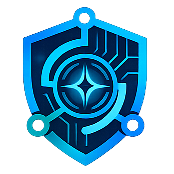

<div align="center">
  <h1>SafeFusion AI</h1>
  <p><strong>AI-Powered Industrial Safety Intelligence Platform for Zero-Harm Operations</strong></p>
  <p>
    
    
    
    
    
    
  </p>
</div>

---

## 📑 Table of Contents

- [Project Overview](#-project-overview)
- [Problem Statement](#-problem-statement)
- [Solution](#-solution)
- [Key Features](#-key-features)
- [System Architecture](#-system-architecture)
- [Technology Stack](#-technology-stack)
- [Pipelines & Engines](#-pipelines--engines)
  - [AI Pipeline](#ai-pipeline)
  - [Computer Vision Pipeline](#computer-vision-pipeline)
  - [Compound Risk Engine](#compound-risk-engine)
  - [Knowledge Graph](#knowledge-graph)
  - [RAG Pipeline](#rag-pipeline)
- [Dashboard Overview](#-dashboard-overview)
- [Folder Structure](#-folder-structure)
- [Installation](#-installation)
- [Running Locally](#-running-locally)
  - [Running Backend](#running-backend)
  - [Running Frontend](#running-frontend)
- [Docker](#-docker)
- [Environment Variables](#-environment-variables)
- [Team](#-team)
- [Future Scope](#-future-scope)
- [License](#-license)
---

## 📖 Project Overview

**SafeFusion AI** is an enterprise-grade industrial safety intelligence platform designed to fuse operational telemetry, computer vision, and knowledge-driven AI into a single decision-support layer for zero-harm operations. It provides real-time situational awareness, predictive risk modeling, and autonomous safety oversight for hazardous industrial environments.

## ⚠️ Problem Statement

Industrial environments face a heavily fragmented safety ecosystem. Traditional CCTV monitoring requires constant human attention, sensor telemetry is disconnected from visual context, and safety protocols reside in static PDF manuals. This siloed approach leads to delayed response times, reactive (rather than proactive) safety measures, and a high cognitive load on safety officers during emergencies.

## 💡 Solution

SafeFusion AI bridges these gaps by integrating real-time computer vision (YOLOv11) with IoT sensor telemetry into a centralized **Compound Risk Engine**. It leverages local Large Language Models (Llama 3 via Ollama) orchestrating via LangGraph to act as an AI Supervisor. By understanding the spatial context of the facility through a Neo4j Knowledge Graph and querying standard operating procedures via a RAG pipeline, the system provides contextualized, explainable, and actionable safety insights instantly.

## ✨ Key Features

- **Real-Time CV Monitoring**: Live CCTV feed processing for PPE compliance (helmets, vests) and hazard detection (fire, smoke).
- **Compound Risk Engine**: Fuses visual anomalies with IoT sensor data (e.g., gas leaks, high temperatures) to evaluate holistic risk levels.
- **AI Safety Copilot**: Conversational AI assistant that provides explainable threat assessments and recommended actions.
- **Dynamic Knowledge Graph**: Maps the spatial relationships between workers, zones, cameras, and sensors to track incidents accurately.
- **RAG-Powered Compliance**: Instantly retrieves safety guidelines from OISD, Factory Act, DGMS, and historical incident reports.

---

## 🏗️ System Architecture


*(Placeholder: Add system architecture diagram to `diagrams/system/architecture.png`)*

The system is built on a distributed microservices architecture:
1. **Frontend**: A highly responsive React SPA communicating via REST and WebSockets.
2. **Backend Core**: A robust FastAPI application handling business logic, CV inference routing, and WebSocket broadcasting.
3. **AI Layer**: LangGraph workflow orchestrating Ollama LLMs and RAG retrievers.
4. **Data Layer**: PostgreSQL for structured telemetry, `pgvector` for embeddings, and Neo4j for spatial topology.

---

## 💻 Technology Stack

### Frontend
- **React 19 + Vite**: Fast, responsive web dashboard.
- **TypeScript**: Type-safe development.
- **Tailwind CSS**: Rapid, scalable UI styling.
- **React Router & Zustand**: Routing and state management.

### Backend
- **FastAPI**: High-performance asynchronous REST APIs.
- **Python 3.11+**: Core backend logic.
- **SQLAlchemy & Alembic**: ORM and database migrations.
- **WebSockets**: Real-time event broadcasting to the frontend.

### Database
- **PostgreSQL**: Relational storage for workers, sensors, permits, and alerts.
- **pgvector**: Vector embedding storage for RAG document retrieval.
- **Neo4j**: Graph database for facility topology and relationship mapping.

### AI & Computer Vision
- **Ollama**: Local execution of open-source LLMs.
- **Llama 3 (8B)**: Reasoning, incident explanation, and recommendations.
- **LangGraph & LangChain**: Multi-agent workflow orchestration and document retrieval.
- **YOLOv11**: Real-time object detection (Helmet, Vest, Worker, Fire, Smoke).
- **OpenCV**: Video stream processing.

---

## ⚙️ Pipelines & Engines

### AI Pipeline
Powered by LangGraph and Ollama, the AI pipeline orchestrates multiple reasoning agents. When an incident occurs, the AI Supervisor ingests the compound risk score, queries the RAG pipeline for standard operating procedures, and generates a contextual, explainable mitigation strategy in real-time.

### Computer Vision Pipeline
Leverages YOLOv11 optimized models to process camera feeds frame-by-frame. It detects workers and classifies their PPE compliance (Helmet, Vest) while simultaneously scanning for environmental hazards like smoke or fire.

### Compound Risk Engine
A deterministic rule engine that fuses multiple data streams. A missing helmet might be a medium risk, but a missing helmet combined with a high-temperature sensor reading in the same topological zone escalates the situation to a critical compound risk.

### Knowledge Graph
Built on Neo4j, the knowledge graph maps the physical layout of the industrial plant. It understands which cameras observe which zones, which sensors are located nearby, and tracks the movement of workers across these areas.

### RAG Pipeline
Utilizes LangChain and `pgvector` to index and retrieve critical safety documentation. The corpus includes:
- OISD Guidelines
- The Factories Act
- DGMS Regulations
- Historical Incident Reports

---

## 📊 Dashboard Overview

The SafeFusion frontend provides a comprehensive situational overview:
- **Live CCTV Grid**: Real-time camera feeds with overlaid bounding boxes and compliance metrics.
- **Safety Heatmap**: Topological map of the facility highlighting active alerts and compound risks.
- **AI Supervisor Panel**: Real-time explanations and recommendations generated by the Llama 3 model.
- **Telemetry Charts**: Historical and live data visualization for connected IoT sensors.

---

## 📂 Folder Structure

```text
safefusion-ai/
├── backend/          # FastAPI backend, DB models, AI agents, CV pipelines
├── frontend/         # React SPA, Tailwind styles, state management
├── datasets/         # Raw, processed, and annotated data for custom CV training
├── diagrams/         # System architecture, deployment, and data-flow diagrams
├── docs/             # Technical specifications, API design, DB schemas
├── knowledge/        # Source documents for RAG (OISD, SOPs, Act)
├── presentation/     # Pitch decks, demo videos, and presentation assets
├── docker-compose.yml# Container orchestration
└── README.md         # Project documentation
```

---

## 🚀 Installation

Ensure you have the following installed:
- [Node.js (v18+)](https://nodejs.org/)
- [Python (3.11+)](https://www.python.org/)
- [Docker & Docker Compose](https://www.docker.com/)

Clone the repository:
```bash
git clone https://github.com/YourOrg/safefusion-ai.git
cd safefusion-ai
```

---

## 🏃‍♂️ Running Locally

### Running Backend
```bash
cd backend
python -m venv .venv
source .venv/bin/activate  # On Windows: .venv\Scripts\activate
pip install -r requirements.txt

# Run the FastAPI server
uvicorn src.main:app --reload
```

### Running Frontend
```bash
cd frontend
npm install

# Start the Vite development server
npm run dev
```

---

## 🐳 Docker

The easiest way to run the full stack (including PostgreSQL, Neo4j, and Ollama) is via Docker Compose. GPU passthrough is configured for the Ollama container to ensure fast local LLM inference.

```bash
# Start all services in detached mode
docker-compose up -d
```
*Note: The `ollama-pull` init container will automatically download the `llama3.1:8b` and `nomic-embed-text` models on the first run.*

---

## 🔐 Environment Variables

Copy the example environment files and update them with your local configurations.

```bash
cp backend/.env.example backend/.env
cp frontend/.env.example frontend/.env
```

Key variables in `backend/.env`:
- `DATABASE_URL`: PostgreSQL connection string.
- `NEO4J_URI` / `NEO4J_USER` / `NEO4J_PASSWORD`: Graph DB credentials.
- `OLLAMA_BASE_URL`: URL to the local Ollama instance (default: `http://localhost:11434`).

## 👥 Team

- **Shalton Menezes** – Backend, AI, Architecture
- **Luke Roman Noronha** – Frontend, UI/UX

---

## 🔮 Future Scope

- **Edge Deployment**: Deploying lightweight YOLO models directly on edge camera hardware via TensorRT.
- **Multi-Modal LLMs**: Upgrading to LLaVA or similar Vision-Language Models for direct natural language querying of camera feeds.
- **Automated Permit Workflows**: Generating and approving work permits automatically based on RAG policy checks and current hazard states.
- **Predictive Maintenance**: Integrating acoustic and vibration sensor data to predict machinery failures before they cause safety incidents.

---

## 📜 License

This project is licensed under the MIT License. See the [LICENSE](LICENSE) file for details.
